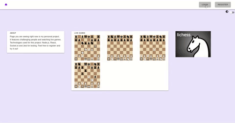
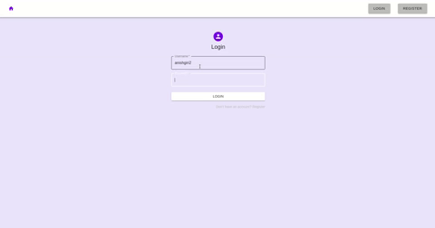
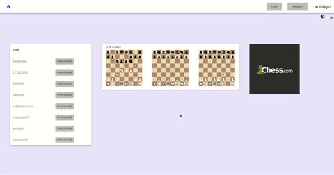
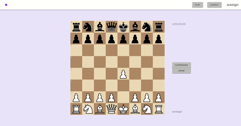
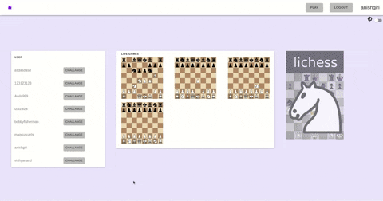
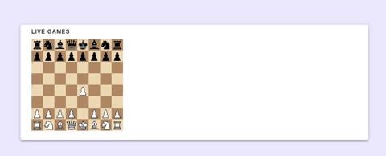
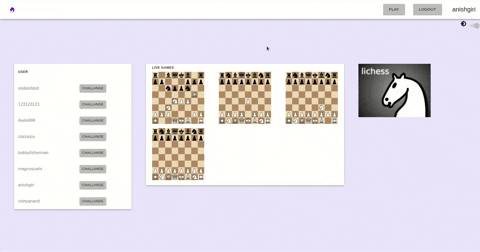

# ♚ Chess7 ♚
Play chess with your friends on chess7!

## Technologies 
* **Backend** Node.js + Express.js
* **Database** MongoDB + Mongoose 
* **Real-time communication** Socket.js
* **Frontend** React.js + Material.ui + Chessboard.jsx
* **Testing** Jest

## Features
* 👤 Setting up an account
* ♜  Playing chess games
* 📺 Watching games live
* 🔔 Real time notifications
* 🌔 Dark/light mode

## Overview
### Account and notifications



### Games

  

### Dark mode


## Issues
* Kind of weird on mobile, but usable
* After rematch you need to go home and then back to /play to see the new game

## TODO
* Game history
* User profile
* Multilingualism

## Run locally
* Clone the repositiory
```bash
git clone https://github.com/hardkov/chess7.git
```
* Set endpoints on frontend
```bash
vim frontend/src/services/config.js
```
```js
// wherever your server is
axios.defaults.baseURL = "http://localhost:5000";
const SOCKET_BASE_URL = "ws://localhost:5000";
```
* Configure backend (server port, database uri, jwt secret)
```bash
vim backend/.env

PORT=
MONGODB=""
JWT=""
